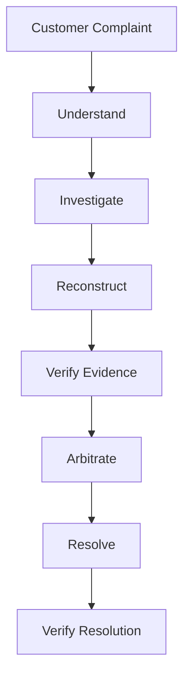
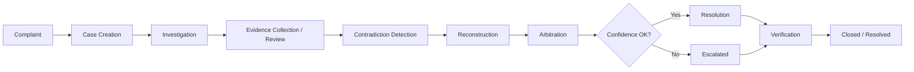
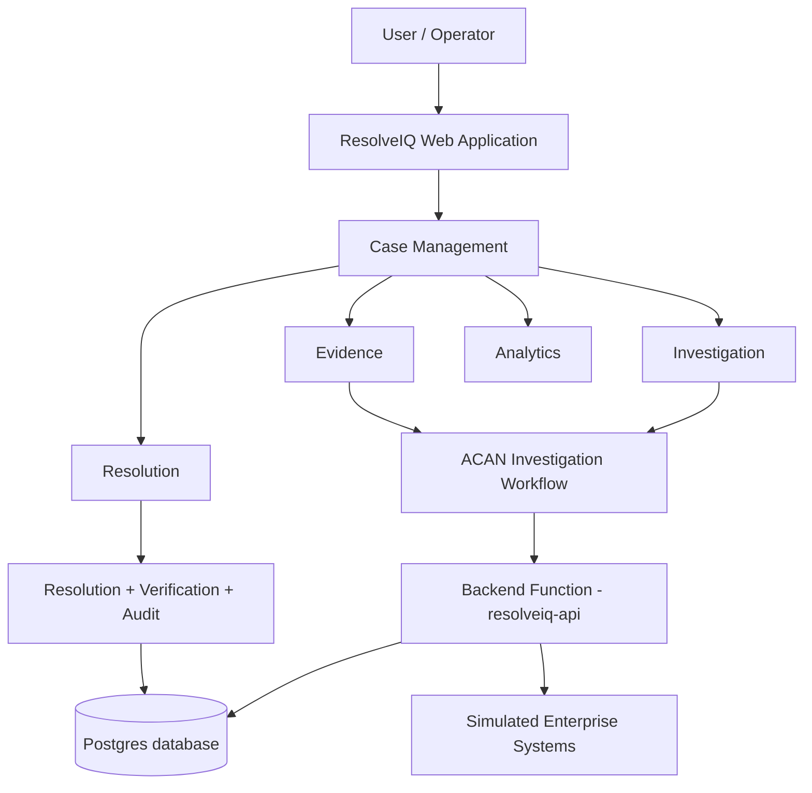

# ResolveIQ — Autonomous Dispute Resolution

ResolveIQ is an AI-assisted enterprise dispute resolution platform designed to investigate complaints, reconstruct events, analyze evidence, identify contradictions, support causal arbitration, and verify resolutions through an auditable workflow. Instead of merely classifying a complaint, ResolveIQ routes it through the **ACAN (Autonomous Causal Arbitration) pipeline** — *Understand → Investigate → Reconstruct → Verify Evidence → Arbitrate → Resolve → Verify Resolution* — so decisions are grounded in evidence, policy and risk rather than guesses.

This repository contains the **Build Bengaluru hackathon prototype**: a fully working full-stack application with a persistent backend, seeded enterprise-style sample data, and a complete complaint-to-verified-resolution demo flow. The investigation "agents" are a deterministic, rule-based simulation of an agentic workflow (no external AI services are required to run the demo).

---

## 🚀 Live Demo

| | |
|---|---|
| **Live application** | https://2d24f4ea26b9405daf2f0c93418c2488.prod.enterapp.pro/ |
| **Source code** | https://github.com/Divish-k/ResolveIQ |

> The demo runs entirely on simulated enterprise data — no external API keys or AI subscriptions are required.

---

## 🎯 Problem Statement

Enterprise complaints and disputes rarely live in one place. Relevant information is typically spread across many systems:

- Customer complaints
- Orders
- Transactions / payments
- Delivery & service records
- Evidence (GPS telemetry, scans, photos, messages)
- Investigation notes
- Resolution actions
- Human escalation records

When this information is disconnected, support teams struggle to:

- reconstruct **what actually happened**
- verify evidence and its provenance
- identify **contradictions** (e.g., a delivery marked *"Delivered"* while GPS shows the vehicle never arrived)
- determine responsibility fairly
- make **consistent, repeatable decisions**
- track resolution to completion
- maintain an **auditable case history** for review and compliance

ResolveIQ addresses this by providing one unified, evidence-centered investigation and resolution workflow.

---

## 💡 Our Solution

ResolveIQ is a **unified investigation and dispute-resolution workflow**, not a simple complaint ticketing system. Each complaint becomes a case that moves through a structured pipeline where:

1. The complaint is **understood** and structured.
2. Available information is **investigated** across simulated enterprise systems.
3. A **causal timeline** is reconstructed from cross-system events.
4. Evidence is **verified** and contradictions are surfaced.
5. An **arbitration** step reasons about what happened and why.
6. A **resolution** is recommended (and, where authorized and low-risk, executed).
7. The resolution is **verified** and the case state is updated.

The current build implements this pipeline with a deterministic scenario engine (described in the [AI / Intelligence Layer](#-ai--intelligence-layer) section). It is a hackathon prototype demonstrating the full workflow with realistic data — not a production AI deployment.

---

## 🧠 ACAN Pipeline



| Stage | Description |
|---|---|
| **1. Understand** | Interpret the complaint and identify relevant case context (customer, order, category, severity, location, incident time). |
| **2. Investigate** | Examine available case information and supporting evidence across simulated Order, Payment, Merchant, Logistics, GPS, Weather and Communication systems. |
| **3. Reconstruct** | Build a coherent sequence of events from the available information, flagging anomalous events. |
| **4. Verify Evidence** | Check supporting evidence and identify inconsistencies or contradictions (e.g., unsupported delivery closure). |
| **5. Arbitrate** | Evaluate the available evidence, policy checks, confidence and risk to support a causal dispute-resolution decision. |
| **6. Resolve** | Recommend the appropriate resolution; low-risk, authorized actions can be executed automatically against simulated systems. |
| **7. Verify Resolution** | Confirm that the resolution completed successfully (payment confirmation, dispatch, notification) and update the case state. |

---

## ✨ Key Features

### Complaint Intake
Structured complaint/case creation with customer, order, category, severity, location, incident time and description fields, plus a one-click **demo complaint** loader for instant walkthroughs.

### AI-Assisted Investigation
An investigation workflow that analyzes case context and supporting information. The prototype runs six specialized investigation agents (Order, Payment, Logistics, Merchant, Policy, Risk) driven by a deterministic scenario engine.

### Evidence Analysis
Centralized evidence review associated with each case, grouped by source (Order, Payment, Merchant, Logistics, GPS, Weather, Communication, Policy) with per-item confidence and verification findings.

### Contradiction Detection
Conflicting evidence is flagged for investigator review — e.g., a delivery marked *"Delivered"* contradicted by GPS telemetry showing the vehicle never reached the destination geofence.

### Confidence Scoring
Confidence is tracked per agent finding and per arbitration decision, displayed via a visual gauge, and used to gate auto-resolution against a configurable threshold (default **85%**).

### Causal Arbitration
Supports reasoning about *what happened and why* — combining evidence, reconstructed events, policy checks (e.g., PD-04, RT-02, BL-01, VD-03, DG-01), risk level and authorization limits — rather than only categorizing the complaint.

### Resolution Verification
Every executed resolution includes a verification stage that confirms success against the simulated systems (payment gateway confirmation, dispatch ID, notification delivery) before the case is closed as *Resolved*.

### Human-in-the-Loop Review
Cases whose confidence falls below the threshold are **escalated to human review** instead of auto-resolving, with full evidence summary, causal finding, policy result, recommended action and audit trail visible to the reviewer.

### Case Timeline
A per-case view of relevant events, evidence, decisions, actions and resolution history across the whole lifecycle, with source attribution and anomaly flags.

### Analytics Dashboard
Operational statistics: cases by status, resolution types executed, confidence distribution, average investigation time, escalated cases, and evidence verification state.

---

## 🔄 End-to-End Workflow



A case moves through the platform as follows:

1. A complaint is submitted and a case is created (`New`).
2. The **ACAN investigation** runs: six agents produce findings and evidence is collected from simulated systems.
3. Evidence is **verified** — statuses become `Verified`, `Contradicted` or `Disputed`.
4. The causal **timeline** is reconstructed and anomalies flagged.
5. **Arbitration** produces a recommended resolution with a confidence score.
6. If confidence is **below threshold** → the case is **Escalated** for human review. If **above threshold** and low-risk → authorized actions are executed and verified.
7. The case closes as **Resolved** once the resolution is verified.

**What the code actually automates vs. what requires humans:** steps 1–6 are executed automatically by the pipeline (rule-based, deterministic in this prototype). Resolution *execution* only fires for authorized, low-risk actions and still presents the recommended action to the operator for a single-click confirmation; escalated cases require explicit human review.

---

## 🏗️ System Architecture



- **Frontend** — React + TypeScript single-page application (Vite build) with react-router, TanStack Query for data fetching, and recharts for analytics.
- **Backend** — a single backend function (`resolveiq-api`, a Deno edge function) exposes the API actions: `seed`, `create-case`, `list-cases`, `get-case`, `list-audit`, `run-investigation`, `verify-evidence`, `arbitrate`, `execute-action`, `verify-resolution`, `escalate`, `analytics`.
- **Data / Backend Integration** — Postgres database provisioned through Enter Cloud (managed Supabase-compatible backend), accessed via the `@supabase/supabase-js` client. Tables: `resolveiq_cases`, `resolveiq_evidence`, `resolveiq_timeline_events`, `resolveiq_agent_findings`, `resolveiq_decisions`, `resolveiq_actions`, `resolveiq_audit_log`, `resolveiq_settings` (all with row-level security enabled).
- **Simulated enterprise systems** — Order, Payment, Merchant, Logistics, GPS, Weather, Communication and Evidence services are implemented *inside the backend function* as deterministic simulations (no external APIs).

> The "AI" / investigation workflow is a deterministic, rule-based scenario engine in this prototype. Real LLM-driven investigation, RAG, and enterprise connectors are future work (see [Future Improvements](#-future-improvements)).

---

## 🖥️ Application Modules

| Module | Description |
|---|---|
| **Dashboard** | Case statistics (total, investigating, awaiting verification, resolved, escalated, average confidence), recent cases, and live investigation activity feed. |
| **New Complaint** | Structured complaint form with category/severity/evidence inputs and a one-click demo complaint loader. |
| **My Cases** | Case list with status filters and full-text search (case number, customer, order, category). |
| **Investigation** | Pipeline view of in-flight cases with per-case ACAN stage progress. |
| **Evidence** | Cross-case evidence index highlighting cases flagged with contradictory or uncertain evidence. |
| **Analytics** | Charts for cases by status, resolution types, confidence distribution and evidence verification state. |
| **Help** | In-app documentation of the ACAN architecture, agents, simulated systems and escalation policy. |
| **Case Detail** | The core workspace — tabs for Overview, Investigation (six agents), Causal Timeline, Evidence, Decision and History. |
| **Human Review / Escalation** | Escalated cases present a "Human Review Required" panel with evidence summary, causal finding, policy result, recommended action, uncertainty notes and audit trail. |

---

## 🤖 AI / Intelligence Layer

**This section is intentionally precise about what the code implements.**

Inspection of the repository (`supabase/functions/resolveiq-api/index.ts` and the React frontend) shows the following intelligence capabilities are **actually present**:

- **Rule-based reasoning** — a deterministic scenario engine encodes six realistic dispute scenarios (grocery delivery disruption, wrong item shipped, double charge, duplicate billing, signed-POD dispute, damaged goods). Each scenario scripts a causal timeline, evidence set (including designed contradictions), agent findings, confidence values, policy checks and arbitration outcome.
- **Simulated multi-agent workflow** — six specialized agents (Order, Payment, Logistics, Merchant, Policy, Risk) are simulated; each produces an evidence summary, a finding and a confidence score. This is a **prototype/demo implementation** of an agentic investigation workflow — there are **no real LLM calls, no API keys, and no external AI models** in the code.
- **Confidence scoring** — per-agent and per-arbitration confidence, compared against a configurable threshold to gate auto-resolution.
- **Evidence analysis & contradiction detection** — evidence statuses (`Verified`, `Contradicted`, `Disputed`) and explicit cross-system contradiction flags (e.g., delivery closure vs. GPS telemetry).
- **Causal reconstruction** — multi-system event timeline with anomaly flags and a "likely cause" summary.
- **Automated decision-making** — arbitration combines evidence, policy checks, risk level and authorization limits to recommend actions; low-risk authorized actions can be executed.

The following are **not** implemented and therefore not claimed: RAG, embeddings/vector search, document retrieval, tool calling, or any real LLM/provider integration.

The scenario engine is deliberately data-driven: the entire demo — including the primary grocery-delivery case — runs deterministically, so a live presentation is always reproducible without network dependencies.

---

## 🔐 Human-in-the-Loop & Auditability

ResolveIQ is designed so AI-assisted decisions can always be reviewed by humans:

- **Escalation** — arbitration confidence below the threshold routes the case to human review instead of auto-resolution.
- **Investigation history** — every agent run, evidence verification and pipeline transition is recorded.
- **Evidence review** — evidence items show source, timestamp, status, confidence and verification result; contradictions are surfaced prominently.
- **Decision visibility** — the arbitration panel exposes the recommended action, confidence, reasoning, policy checks and risk level.
- **Resolution verification** — executed actions show system confirmations (transaction ID, dispatch ID, message ID) before the case is marked resolved.
- **Audit trail** — a full `resolveiq_audit_log` records every action (operator and system), timestamped and linked to its case, and is shown in the case History tab.

---

## 📊 Dashboard & Analytics

The dashboard displays metrics computed from real case data:

- **Total Cases**
- **Investigating** (new + in-progress)
- **Awaiting Verification**
- **Resolved**
- **Escalated**
- **Average Confidence** (with the auto-resolution threshold shown)
- **Recent Cases** (with status, confidence and last-updated time)
- **Investigation activity feed** (recent system/operator events)

The **Analytics** page adds: cases by status (donut), resolution types executed (bar), confidence distribution (bar), evidence verification state (donut), average investigation time, escalated count and evidence-conflict count.

---

## 🌍 Internationalization

The application ships an i18n foundation built on:

- `i18next`
- `react-i18next`
- `i18next-http-backend`
- `i18next-browser-languagedetector`

Configuration lives in `i18n.config.json` (language manifest: fallback language, language codes, labels, detection rules and text direction), with translation bundles under `public/locales/{code}.json` (currently **English** and **简体中文 / zh-CN**) and runtime setup in `src/i18n/`. Language is detected from the cookie, browser and `<html>` tag, and the app syncs `<html lang>` / `<html dir>` accordingly. A language-switcher component is included.

> The primary product UI is currently authored in English; additional Indian languages are an intended future expansion, not a completed translation effort.

---

## 🛠️ Technology Stack

| Layer | Technology |
|---|---|
| **Frontend framework** | React 19, TypeScript |
| **Build tooling** | Vite 7, pnpm |
| **Styling** | Tailwind CSS 3, shadcn/ui components, CSS design tokens |
| **Routing / data** | react-router-dom 7, @tanstack/react-query |
| **Charts** | recharts |
| **Icons / UI extras** | lucide-react, sonner (toasts), framer-motion |
| **Internationalization** | i18next, react-i18next, i18next-http-backend, i18next-browser-languagedetector |
| **Backend** | Backend functions (Deno edge functions) exposed as the `resolveiq-api` endpoint |
| **Database** | Postgres via Enter Cloud (managed Supabase-compatible backend), `@supabase/supabase-js` client |
| **Hosting** | Deployed to the production URL below |
| **Version control** | GitHub |

---

## 📁 Project Structure

```
ResolveIQ/
├── public/
│   ├── locales/                 # i18n translation bundles (en, zh-CN)
│   ├── favicon.ico
│   └── robots.txt
├── src/
│   ├── components/
│   │   ├── case/                # ACAN case UI (stepper, agents, timeline, evidence, decision, history)
│   │   ├── layout/              # application shell (sidebar, top bar, navigation)
│   │   ├── shared/              # badges, confidence gauge, stat cards
│   │   └── ui/                  # shadcn/ui primitives
│   ├── context/                 # operator (demo access) context
│   ├── hooks/                   # shared hooks
│   ├── i18n/                    # i18next configuration and helpers
│   ├── integrations/supabase/   # generated client and database types
│   ├── lib/                     # API client, domain types, formatters
│   └── pages/                   # Login, Dashboard, Submit, Cases, CaseDetail,
│                                # Investigation, Evidence, Analytics, Help
├── supabase/
│   ├── config.toml              # backend project configuration
│   ├── functions/
│   │   └── resolveiq-api/       # backend function (ACAN pipeline + simulated systems)
│   └── migrations/              # database schema migrations
├── .env.example                 # environment variable reference
├── package.json
├── pnpm-lock.yaml
├── tailwind.config.ts
├── vite.config.ts
└── README.md
```

---

## 🔒 Security

- **Never commit API keys or secrets.** All secrets live in backend environment variables; no keys, tokens or passwords are stored in the repository or the frontend bundle.
- **Environment variables** are used for sensitive configuration.
- **`.env` files are git-ignored** so they never enter version control.
- **`.env.example`** is provided as a configuration reference only (see the repository root).
- **Row-level security** is enabled on every database table; all data access flows through backend functions, and no admin/ownership checks are performed on the client.

---

## ⚙️ Local Development

```bash
# 1. Clone the repository
git clone https://github.com/Divish-k/ResolveIQ.git

# 2. Navigate into the project
cd ResolveIQ

# 3. Install dependencies
pnpm install

# 4. Start the development server
pnpm dev
```

Other useful commands:

```bash
pnpm lint        # ESLint
pnpm exec tsc --noEmit   # TypeScript type-check
pnpm build       # production build
```

> The application requires a configured backend (Enter Cloud). Follow `.env.example` and the repository's backend setup to connect the database and deploy the `resolveiq-api` backend function.

---

## 🧪 Demo / Sample Case

The application ships with **six realistic seeded cases**, deliberately spread across the workflow states implemented in the code/UI:

| State | Meaning |
|---|---|
| `New` | Complaint submitted, not yet investigated |
| `Awaiting Verification` | Investigation complete, evidence verification pending |
| `Arbitrating` | Evidence verified, arbitration decision ready |
| `Resolved` | Resolution executed and verified |
| `Escalated` | Confidence below threshold, awaiting human review |

The **primary demo case** (`RIQ-2026-0142`, *grocery delivery disruption*) is wired to run the entire investigation-to-resolution workflow live:

1. Open the case and run the **ACAN investigation** (six agents complete with findings).
2. **Reconstruct** the causal timeline — order placed → merchant accepted → driver assigned → GPS stationary → flood signal → complaint → unsupported *"Delivered"* closure.
3. **Verify evidence** — the delivery closure is flagged as **contradicted** by GPS telemetry and scan history.
4. **Arbitrate** — the engine recommends **Refund $86.40 + Re-dispatch**, at 92% confidence, against policy checks (PD-04, AUTH-02, FRAUD-01) with low risk.
5. **Resolve** — execute the recommended actions; the simulated payment gateway returns a transaction ID, re-dispatch schedules a courier, and the customer is notified.
6. **Verify Resolution** — "Resolution verified successfully" and the case is marked **Resolved**.

Escalation is demonstrated by the seeded signed-POD dispute and damaged-goods cases, which show the **"Human Review Required"** panel with evidence summary, causal finding, policy result, recommended action, uncertainty and audit trail.

You can also submit a fresh complaint from the **New Complaint** page (or load the demo complaint) and watch the same pipeline run from intake to verified resolution.

---

## 🏆 Hackathon

**Hackathon:** Build Bengaluru  
**Venue:** Microsoft Office, Bengaluru  
**Team:** Code Titans

---

## 🎯 Why ResolveIQ

- **Investigation instead of simple classification** — every complaint is run through a structured, evidence-centered pipeline rather than labeled and closed.
- **Evidence-centered decisions** — arbitration is grounded in evidence collected across systems, not in a single ticket field.
- **Contradiction visibility** — conflicting evidence is surfaced explicitly instead of being papered over.
- **Causal reconstruction** — cases show *what happened and why*, with anomaly flags on a multi-system timeline.
- **Resolution verification** — no case is closed until the resolution is confirmed against the systems that executed it.
- **Human oversight** — low-confidence cases are routed to human review with full context.
- **Auditable workflows** — every step, decision and action is recorded in an audit trail.

---

## 🚀 Future Improvements

The following are **future work** — they are not part of the current prototype:

- **Production-grade RAG** over enterprise documents and knowledge bases to ground investigation findings.
- **Stronger evidence provenance** — signed hashes, chain-of-custody and source integrity metadata for every evidence item.
- **Enterprise system connectors** — real integrations with ERP, payment gateways, logistics and weather APIs instead of simulated systems.
- **Advanced agent orchestration** — genuine LLM-driven agents with tool calling, planning and reflection, backed by a managed AI model provider.
- **Automated evidence retrieval** — pulling documents, photos and telemetry programmatically during investigation.
- **Explainable arbitration decisions** — structured attribution of each decision factor (evidence, policy, risk) for compliance review.
- **Multilingual expansion** — full translation of the product UI into Indian languages using the existing i18n foundation.
- **Role-based access control** — operator, reviewer and admin roles with scoped permissions.
- **Production monitoring** — observability, alerting and performance dashboards.
- **Stronger audit/compliance controls** — immutable audit exports, retention policies and sign-off workflows.

---

## 👥 Team

**Code Titans**

Project: **ResolveIQ — Autonomous Dispute Resolution**  
Hackathon: **Build Bengaluru**  
Venue: **Microsoft Office, Bengaluru**

---

## 📄 License

This project was developed as a hackathon prototype.
